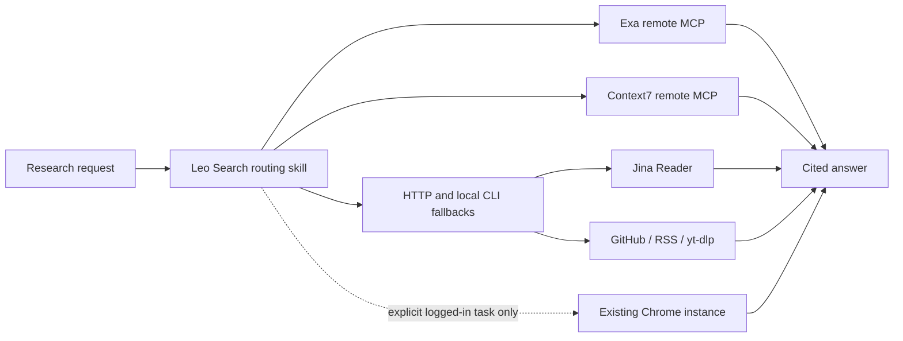

# Leo Search

Leo Search is a Codex plugin for current web and technical research without creating browser automation processes. It bundles two stateless remote MCP routes and a routing skill:

- Exa for current web search and clean URL extraction
- Context7 for current library documentation
- Jina Reader, GitHub CLI, RSS, `yt-dlp` and Agent Reach-compatible CLIs as browser-free fallbacks
- Existing Chrome only for an explicitly requested logged-in task; tabs opened for the task must be closed

It does not install Playwright, Patchright, Puppeteer, Selenium, Crawl4AI or a heartbeat/daemon. If an explicitly requested logged-in task uses the existing OpenCLI bridge, the skill closes its task tabs and stops that bridge afterward.

## Install on another Mac or Linux device

```bash
/bin/bash -c "$(curl -fsSL https://raw.githubusercontent.com/leoyb1010/leo-search/main/scripts/bootstrap.sh)"
```

The installer clones to `~/plugins/leo-search`, preserves other personal Marketplace entries, installs `leo-search@personal`, and runs a read-only resource check. Start a new Codex task after installation so the new skill and MCP tools are loaded.

No API key is required for the default routes. Service-side anonymous limits may apply; keep credentials outside this repository if you later add them.

## Verify

```bash
~/plugins/leo-search/scripts/doctor.sh
~/plugins/leo-search/scripts/doctor.sh --deep
```

`--deep` also runs Agent Reach's own channel doctor when Agent Reach is installed. Neither mode opens a browser.

The normal check performs real MCP `initialize` requests, validates Jina over HTTP, reports RSS and installed CLI capabilities, and checks for browser-process buildup. The deep check also verifies GitHub authentication.

Run the local regression and lint checks before publishing changes:

```bash
./tests/doctor_test.sh
shellcheck scripts/*.sh tests/*.sh
```

## Optional account-bound channels

Install the optional Agent Reach-compatible tools without importing cookies:

```bash
agent-reach install --env local --channels all
```

OpenCLI still requires the user to install and enable its Chrome extension. Twitter, Xueqiu and other logged-in sources require an explicit cookie import or an already authenticated browser session. Never import cookies implicitly, and stop the OpenCLI daemon after each account-bound task:

```bash
opencli daemon stop
```

## Update

```bash
~/plugins/leo-search/scripts/update.sh
```

## Architecture



## Privacy and resource boundaries

Queries sent to remote MCP services are processed by those providers. Do not include secrets, credentials or private source code in search queries. Ordinary research must remain on HTTP/MCP/CLI routes. If an account-bound task truly needs the existing Chrome session, request that explicitly and verify tab/process cleanup afterward.

## License

MIT
