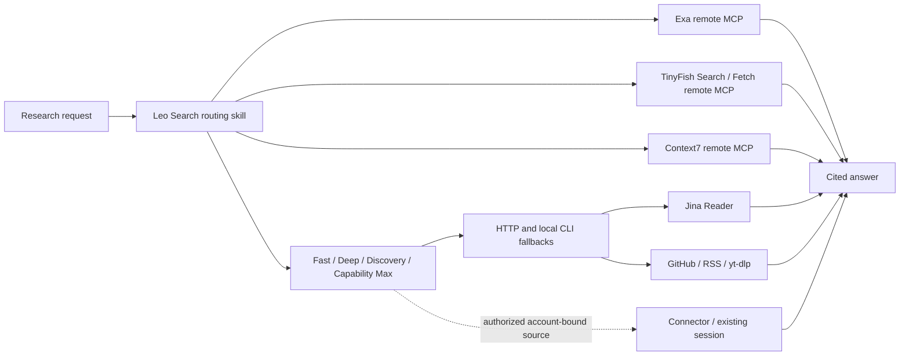

# Leo Search

Leo Search is a Codex plugin for current web and technical research with four adaptive modes: Fast, Deep, Discovery and Capability Max. It bundles remote MCP routes, evidence normalization and a routing skill:

- Exa for current web search and clean URL extraction
- TinyFish for live web/news/paper search and browser-rendered public URL extraction
- Context7 for current library documentation
- Jina Reader, GitHub CLI, RSS, `yt-dlp` and Agent Reach-compatible CLIs as browser-free fallbacks
- Agent Reach-compatible public and account-bound channels when requested
- Evidence-ledger normalization for canonical URLs, content hashes and exact duplicate removal

Ordinary Fast research stays on remote MCP, HTTP and CLI routes. Capability Max may reuse an authorized connector, remote extraction worker or already-open authenticated session for sources the ordinary route cannot reach. The plugin does not silently install browser automation or start a heartbeat/daemon.

## Install on another Mac or Linux device

```bash
/bin/bash -c "$(curl -fsSL https://raw.githubusercontent.com/leoyb1010/leo-search/main/scripts/bootstrap.sh)"
```

The installer clones to `~/plugins/leo-search`, preserves other personal Marketplace entries, installs `leo-search@personal`, and runs a read-only resource check. Start a new Codex task after installation so the new skill and MCP tools are loaded.

Expose the same canonical skill to other local Agents without creating another version:

```bash
python3 ~/plugins/leo-search/scripts/install_portable.py
```

No API key is required for the default routes. TinyFish requires a valid OAuth session and a TinyFish account; reauthorization may be needed when a refresh token expires or is revoked. Provider plans and limits may change. Authenticate from Codex's MCP server settings when prompted. Service-side limits may apply, and credentials remain outside this repository.

## Verify

```bash
~/plugins/leo-search/scripts/doctor.sh
~/plugins/leo-search/scripts/doctor.sh --json
~/plugins/leo-search/scripts/doctor.sh --deep
```

`--deep` also runs Agent Reach's own channel doctor when Agent Reach is installed. Neither mode opens a browser.

The normal check performs real MCP `initialize` requests for Exa and Context7, validates TinyFish's OAuth metadata and Jina over HTTP, reports RSS and installed CLI capabilities, and checks for browser-process buildup. `--json` schema v2 explicitly reports connectivity-only scope and includes resource checks. OAuth metadata is INFO, never retrieval proof. TinyFish authentication itself is verified from Codex after OAuth. The deep check also verifies GitHub authentication.

If direct Jina access fails on macOS because a local proxy uses fake-IP DNS, the doctor retries through the loopback HTTPS proxy already declared by `scutil --proxy`. It never changes proxy settings or accepts a remote proxy address.

For the personal installation, keep TinyFish restricted to the two free read-only tools:

```toml
[plugins."leo-search@personal".mcp_servers."leo-search-tinyfish"]
enabled = true
default_tools_approval_mode = "approve"
enabled_tools = ["search", "fetch_content"]
```

Run the local regression and lint checks before publishing changes:

```bash
./tests/doctor_test.sh
python3 tests/test_evidence_ledger.py
shellcheck scripts/*.sh tests/*.sh
```

## Optional account-bound channels

Install the optional Agent Reach-compatible tools without importing cookies:

```bash
agent-reach install --env local --channels all
```

OpenCLI still requires the user to install and enable its Chrome extension. Twitter, Xueqiu and other logged-in sources require an explicit cookie import or an already authenticated browser session. Never import cookies implicitly, and stop the OpenCLI daemon after each account-bound task:

```bash
opencli daemon stop
```

## Update

```bash
~/plugins/leo-search/scripts/update.sh
```

## Architecture



## Evidence ledger

Normalize JSONL evidence before synthesizing a multi-source answer:

```bash
printf '%s\n' '{"url":"https://example.com/story?utm_source=x","title":"Story"}' | \
  ~/plugins/leo-search/scripts/evidence_ledger.py
```

The ledger canonicalizes URLs, removes tracking parameters and collapses exact URL/content duplicates. It preserves source links, claim IDs and conflicting support annotations, and groups identical content/shared upstream reporting. A separate group is not proof of independent reporting.

On a restricted host, keep a host-specific proxy URL in `~/.config/leo-search/proxy` and run CLI fallbacks through:

```bash
~/plugins/leo-search/scripts/with_proxy.sh <command> [args...]
```

This changes only the child command environment, not the machine's global proxy.

## Data boundaries

Queries and fetched URLs sent to remote services are processed by those providers. Do not include credentials or private project content in search/fetch requests. For account-bound research, use only the source and session the user requested, keep the task read-only, and close task-created tabs/controllers afterward.

## License

MIT

## 1.4.0: bounded retrieval and real readiness

```sh
# Normal task health: connectivity only, no research quota consumed by search calls
./scripts/doctor.sh --json
# Three public retrieval probes, at most 8 requests, in-run response reuse
python3 scripts/smoke.py --output benchmarks/results/smoke.json
# Native tool visibility, using existing host credentials without exposing them
python3 scripts/codex_probe.py
# Exactly one TinyFish tool call; no model turn and no persisted task
python3 scripts/codex_probe.py --search
# Release benchmark only, not for each user question
python3 scripts/smoke.py --benchmark --max-requests 28 --output benchmarks/results/retrieval.json
# Rerun only a named failure, or use its known direct official fallback
python3 scripts/smoke.py --case exa-03 --fallback-only --max-requests 2
```

Fast normally starts with one useful query/read and a working allowance of four remote operations. Deep/Discovery extend only for named evidence gaps. User-specified budgets are hard limits. Do not repeatedly retry authentication errors, duplicate searches or already-fetched pages. Preserve Chinese/local-source needs, exact versions, freshness and independent-source requirements.

The runner counts **network requests**, not paid API units or tokens. Reuse is process-local; no cross-user or stale persistent cache is created. Benchmark checks measure retrieval contracts (content, source, topic), not answer-level accuracy. See `benchmarks/README.md` for measured results and limits.

For plugin updates, use the installed plugin-creator cachebuster/validation helpers and `codex plugin add leo-search@personal` against the existing local marketplace. The historical 1.3.0 working copy is preserved in Git before 1.4.0 changes.
